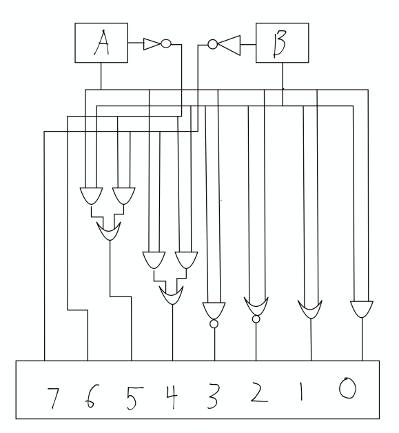
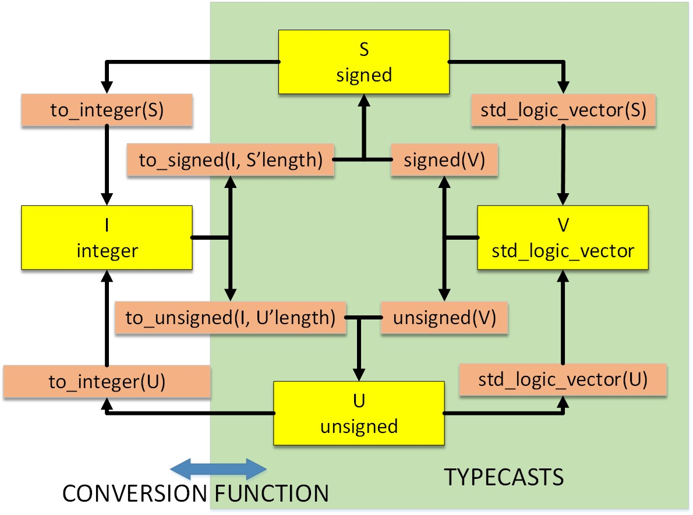

# Computer Architecture
## MIPS-1-4 Group Desiged ALU

### MIPS 1 Overview
You will collaboarate on MIPS_1-4 as a group to design a custom Arithmetic Logic Unit in VHDL.

Please complete MIPS_1-1 through MIPS_1-3 before starting as a group on MIPS_1-4. That way everyone will be on the same page. You may talk to one another about Parts 1 to 3, but, you must not share code electronically for parts 1 to 3 or copy directly from another student.


### Grade Break Down
| Part                               |   | Points  |
|------------------------------------|---|---------|
| MIPS_1-4 a - Group Designed ALU    |   | 15 pts  |   
| MIPS_1-4 b - Answers to Questions  |   | 15 pts  | 
| MIPS_1-4 c - Mini Presentation     |   | 20 pts  |    
| Total                              |   | 50 pts  |

NOTE: MIPS_1-4 will be graded separately and will be worth 50 points as well. 

### Group Project Structure and Professionalism
You will be assigned a group for this ALU project. Professional conduct when interacting with others in your group will be important. 

Desirable group behaviors are:
* Treating your group partner(s) the way you wish to be treated. 
* Following through on scheduled meetings (or texting/emailing if there is an emergency and a meeting can't be attended on time)
* Practicing good listening skills and diplomacy when discussing issues or problems with the hardware design. 
* Working to seek an understanding of your group partners and then focus on fixing issues.

In addition, since this project will be completed as a group, all VHDL hardware will be written utilizing pair/group programming, this means that:
* All group members will be present and actively engaged (e.g. using Live Share and Discord)  when working on the major hardware components together.
* Look for ways to include all group members in the design and learning process.  
* The rest of the work should be evenly divided among the group members and all group members should review all work before submitting it.
* The development of the documentation preferably should be done as a pair/group, but this is not required.
* Reliability in attending meetings, group project participation, will all form a part of your final grade for this project. 

### Defining the Group ALU Functionality
Think about the ALU and the operations your group would like it to support in your microprocessor.  There are several competing concerns when designing an ALU:  

* The number of hardware resources used to implement the design (e.g. total number of logic gates)
* The number of useful operations that the ALU can perform.  
* The efficiency of those operations. For example, we can implement any algorithm using just an adder, however, that may not be efficient enough for the types of programs we want to run. (e.g. if we need to do a large number of multiplications, then we need a program to compute multiplication which is not as efficient as hardware-based multiplication.)
* What are real processor's ALUs like?
  - Xilinx (the maker of our Artix-7 FPGA) has a softcore processor called MicroBlaze. If you open the following document and search for ALU, on page 10 of the document you will see a block diagram of their processor. You will also see the ALU diagram which shows some of the operations it implements. https://www.xilinx.com/support/documentation/sw_manuals/mb_ref_guide.pdf 
  - Intel has designed a Nios II processor for its family of FPGA. You can see what ALU operations they support in this document: https://www.intel.com/content/www/us/en/programmable/documentation/iga1420498949526.html#iga1409259983159
* Advanced, not required: Do you want floating point operations? You don’t need floating point operations to meet the requirements for this class. However, they are both cool and costly. Floating point operations take a significant amount of hardware resources. You can either attempt to design your own floating-point computations, or you can use Vivado’s Intellectual Property (IP) core library that has a floating-point unit. With either approach there are a lot of details, and it will take you a significant amount of time to figure out. Here is the documentation for the IP floating point library:  https://www.xilinx.com/support/documentation/ip_documentation/floating_point/v7_1/pg060-floating-point.pdf 

Obviously we need enough instructions to make the processor capable of doing useful work in an efficient manner. Think about a generic C++ program. What sorts of operations are used (e.g. arithmetic, logic, comparisons, etc.)? What ALU operations do you need?


## ALU Hardware Design
In groups, complete the following steps and put your answers in this document and push them to whitgbit.

A template VHDL project has been created for you to use with your group. 

0. What ALU instructions does your group want to use (or need to use)?  In your group, decide what ALU operations you feel you will need in order to make your processor capable of having a useful instruction set. List your groups ALU instructions here:

     ```
     We are designing our ALU to handle lots of different logic functions:
          - A and B
          - A or B
          - A xor B
          - A NAND B 
          - A NOR B
          - A XNOR B 
          - not a 
          - not b

     ```

1. Draw a hardware diagram for your group's ALU.  What components will you need?
Hardware Diagram

(Hardware Diagram)
For this implementation we will need 5 and gates, 1 nand gate, 3 or gates, 2 inverters, and 1 nor gate. 

2. Design the alu.vhd file. A template / stub file has been created for you. Make sure to design VHDL that will implement your hardware design. 
   Aye Aye Captain

3. Design the ./sim_testbench/sim_group_alu.vhd file. This should test your ALU and verify that it works.
   
4. Check the setup_project.tcl file to make sure all the settings are correct for your group project before you run the ./gen.sh script. 
   
5. Run the ./gen.sh that will create the ```group_alu``` vivado project folder and load the group's alu.vhd file from this folder.  Likely you will have errors. Look at the .log file generated to find the errors. If you load the .log file in vscode yuou can click on the links to the errors.  If a .xpr file (vivado project file) is generated, you can doiuble click on it to open it in vivado. You can see errors in the gui and track them down that way too (see the ./group_alu/sim_group_alu.xpr file ) unless you renamed these folders / files in the .tcl script file.

3.	How many resources of the FPGA  (e.g. slice LUTs, Slices, LUT as logic, Bonded IOBs) are used in your group's ALU design?	 To find this for your project, under the Implementation menu, click on "Open Synthezied Design". After this opens, from the main _Reports_ menu at the top of Vivado, select the "Report Utilization..." option. YOu will see four columns. Put your answers from each of these columns in the box below where indicated:
     ```
          Put your answers in the areas indicated...
          Slice LUTs used (out of 20800 total): 4
          Slices used (out of 8150): 2
          LUT as Logic (out of 20800) : 4 
          Bonded IOBs use (out of 106): 39
     ```				
4.	What is the ratio of slices to instructions for your group's ALU? (slices / instruction)
     ```
          2/8=1/4
     ```	

5. How does your group's ALU compare to the two previous ALUs we looked at?

     ```
          Our ratio is actually better than the two previous ALU's, because the textbook ALU ratio is 2/7, and the wikipedia ratio is 6/7. 
          As well, the textbook ALU used 6 slices, whereas this ALU used 4 slices. 
          The textbook ALU had 6 LUT as logic, whereas our ALU had 4 LUT as logic. 
     ```	

6. Now, program the BASYS 3 board using the bitstream generated from the group's project. Set the switches as neccessary so that the ALU will compute. Verify that it is computing correctly according to the simulation. 	
     ```
     We cannot program the board, we have tried 3 different boards on 3 different computers with multiple different cables. :(
     ```	

### Put the VHDL CODE for the Group's Processor Here
```-------------------------------------------------
-- Module Name: alu - group designed
-------------------------------------------------
library IEEE;
use IEEE.STD_LOGIC_1164.all;
use IEEE.STD_LOGIC_UNSIGNED.all;
use IEEE.NUMERIC_STD.all;   

--Defines our alu entity with a generic value of 32 bits used for inputs a and b
--3 bit function vector corresponds to 8 different operations for our alu
--Output y shares the same number of bits as the inputs a and b
entity alu is
    generic ( N : integer := 32 );
    port ( a, b : in STD_LOGIC_VECTOR(N-1 downto 0);
      f : in STD_LOGIC_VECTOR(2 downto 0);
      Y : out STD_LOGIC_VECTOR(N-1 downto 0));
end alu;

--Behavioral architecture defining implementation of our ALU
architecture Behavioral of alu is
begin 
  --Process runs with our two inputs, the function vector, and the output
    process (a, b, f)
    begin
      case f(2 downto 0) is 
        when "000" => Y <= a and b;
        when "001" => Y <= a or b;
        when "010" => Y <= a nor b;
        when "011" => Y <= a nand b;
        when "100" => Y <= a xor b;
        when "101" => Y <= a xnor b;
        when "110" => Y <= not a;
        when "111" => Y <= not b;
        when others => Y <= (others => 'X');
      end case;
    end process;
end Behavioral;
```

### Mini ALU Presentations to the Class

On the due date for this design, each group presentation will take 5 minutes max.  Groups will present their ALU design to the class in Discord. 
* Don’t bring up your ALU in Vivado (that will take too long). Instead, take screen snips to prove your test bench works, etc. 
* Do not use more than 4 or 5 slides to summarize your design. 
* Do NOT go over time. Make sure each group member presents a minimum of 1 of your 5 slides.

#### Presentation Timeline
Minute 1:  What instructions you chose and why you chose them.
Minute 2:  A neatly designed and drawn hardware diagram of your ALU with inputs and output clearly labelled. Do not draw this by hand. 
Minute 3:  A list of the ALU operation codes (opcodes) 
Minutes 4 – 5:  An overview of your VHDL for the ALU and the VHDL for your test bench. Be sure and present the rough design efficiency metric (slices per instruction).  
* NOTE: this is an extremely rough estimate. Some instructions could be complex (e.g. floating point) and take a significant amount of resources. Another metric for comparing designs would be to compare clock cycles per instruction but more on that later…  
* NOTE: You will not be graded this time on processor efficiency. But a useful processor with a low slices/instruction ratio is desirable.

# Data Type Conversions in VHDL
When you examine the code, you will notice the various data type conversions and typecasts. The next figure demonstrates how to convert (and typecast) between various data types in VHDL.



# Important notes:

* If you leave the Vivado project running when you got to re-run the project generation (./gen.sh), the generation will fail! You MUST close Vivado when re-generating a project!
* Always READ the outputs of the ./gen.sh script. If you see Error messages, something is wrong and you will need to fix the errors!
* Warnings are not neccessarily a problem.

# Generating and running a simulation
Open a bash terminal in vscode, and run the following command in the terminal:
```
./gen.sh
```
This will generate the Vivado project automatically. Open the folder that the script generates and find and run the .xpr file for the vivado project.


